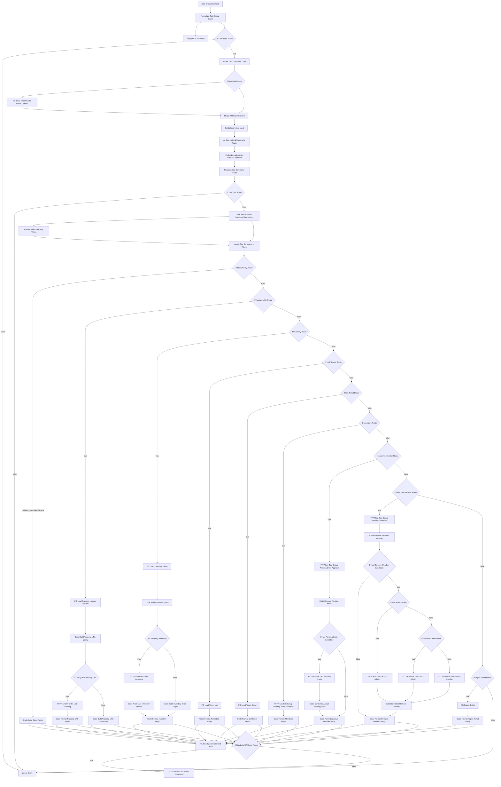

# Tổng Hợp ZaloWorkflow

## Mục tiêu

`ZaloWorkflow.json` là workflow xử lý lệnh nội bộ trong nhóm Zalo cho team sale. Workflow nhận webhook từ Zalo OA, hiểu ý định từ tin nhắn tự nhiên, điều hướng sang đúng nhánh xử lý, ghi audit vào Postgres và phản hồi lại vào nhóm.

## Thông số hiện tại

- Tên workflow: `ZaloWorkflow`
- Workflow ID: `MGvFgvQa9fQghQw4`
- Trạng thái: `active = false`
- Số node: `68`
- Số cụm connection: `66`

## Luồng tổng quát

## Giai đoạn hiểu lệnh

### 1. Normalize đầu vào

Node: `Normalize Zalo Group Event`

Việc làm:

- Chuẩn hóa payload Zalo về dạng dùng chung.
- Rút các field:
  - `oa_id`
  - `group_id`
  - `sender_id`
  - `sender_display_name`
  - `message_id`
  - `text`
  - `mention_user_ids`
- Xác định `normalized_event_type`.
- Gắn cờ:
  - `should_route_command`
  - `should_process_message`
  - `looks_like_operational_message`

### 2. Draft parser

Node: `Parse Zalo Command Draft`

Việc làm:

- Nhận slash command.
- Nhận `T-<id>` hoặc số ticket.
- Nhận mention kiểu `[@123456]`, `@123456`.
- Nhận role `viewer`, `sales`, `manager`.
- Bóc tách sơ bộ:
  - `tool_name`
  - `ticket_id`
  - `lookup_value`
  - `role_value`
  - `reason_text`
  - `ticket_scope`
  - `product_query`
  - `max_results`
- `needs_ai_router` hiện đang luôn được set để AI chạy tiếp.

### 3. AI router

Các node:

- `PG Load Recent Zalo Action Context`
- `Merge AI Router Context`
- `Set Zalo AI Intent Input`
- `AI Zalo Natural Command Router`
- `Code Normalize Zalo Natural Command`

Context được bơm cho AI:

- `recent_actions`
- `recent_ticket_actions`
- `open_tickets`
- `open_ticket_total`
- `latest_ticket_id`
- `latest_open_ticket_id`

Schema AI trả về:

- `tool_name`
- `ticket_id`
- `ticket_scope`
- `lookup_value`
- `city_query`
- `district_query`
- `max_results`
- `role_value`
- `reason_text`
- `reply_text`
- `confidence`

Các intent đang được map:

- `help`
- `list_tickets`
- `get_ticket`
- `tracking_url`
- `check_inventory`
- `members`
- `add_member`
- `approve_member`
- `remove_member`
- `add_admin`
- `remove_admin`
- `reject_ticket`
- `unknown`

### 4. Route resolver

Node: `Resolve Zalo Command Route`

Map từ `tool_name` sang:

- `route_key`
- `handler_name`
- `required_app_role`

Nếu không route được nhưng vẫn có `reply_text`, workflow chuyển sang `fallback`.

## Danh sách chức năng chi tiết

## 1. Help

- Route: `help`
- Node chính:
  - `If Static Reply Route`
  - `Code Build Static Reply`
- Kết quả:
  - trả menu lệnh và ví dụ dùng.

## 2. Xem danh sách ticket

- Route: `list_tickets`
- Node chính:
  - `If List Tickets Route`
  - `PG Load Ticket List`
  - `Code Format Ticket List Reply`
- Nguồn dữ liệu:
  - `public.lead_handoff_queue`
- Hỗ trợ:
  - `ticket_scope = open`
  - `ticket_scope = all`
- Output:
  - tổng số ticket
  - danh sách rút gọn dạng `T-id | trạng thái | khách`

## 3. Xem chi tiết một ticket

- Route: `get_ticket`
- Node chính:
  - `If Get Ticket Route`
  - `PG Load Ticket Detail`
  - `Code Format Get Ticket Reply`
- Nguồn dữ liệu:
  - `public.lead_handoff_queue`
- Output:
  - trạng thái
  - khách
  - SĐT
  - sản phẩm
  - nhu cầu
  - lý do
  - người nhận
  - người đóng
  - thời gian tạo

## 4. Reject ticket

- Route: `reject_ticket`
- Node chính:
  - `If Reject Ticket Route`
  - `PG Reject Ticket`
  - `Code Format Reject Ticket Reply`
- Nguồn dữ liệu:
  - `public.lead_handoff_queue`
- Hành động:
  - update `status = cancelled`
  - ghi `closed_by_user_id`
  - ghi `closed_by_display_name`
  - ghi `closed_reason`
  - ghi `closed_at`
- Output:
  - reject thành công
  - ticket không tồn tại
  - ticket đã reject
  - ticket đã đóng

## 5. Tracking URL

- Route: `tracking_url`
- Node chính:
  - `If Tracking URL Route`
  - `PG Load Tracking Lookup Context`
  - `Code Build Tracking URL Query`
  - `If Can Query Tracking URL`
  - `HTTP Nhanh Order List Tracking`
  - `Code Format Tracking URL Reply`
  - `Code Build Tracking URL Error Reply`
- Nguồn dữ liệu:
  - `public.nhanh_api_tokens`
  - `public.lead_handoff_queue`
  - `public.order_tickets`
- Có thể lookup theo:
  - `ticket_id`
  - số điện thoại
  - mã đơn Nhanh
- Output:
  - 1 tracking URL
  - danh sách tracking gần nhất
  - thông báo không tìm thấy / thiếu dữ liệu

## 6. Kiểm tra tồn kho

- Route: `check_inventory`
- Node chính:
  - `If Inventory Route`
  - `PG Load Inventory Token`
  - `Code Build Inventory Query`
  - `If Can Query Inventory`
  - `HTTP Nhanh Product Inventory`
  - `Code Normalize Inventory Result`
  - `Code Build Inventory Error Reply`
  - `Code Format Inventory Reply`
- Nguồn dữ liệu:
  - `public.nhanh_api_tokens`
- API:
  - `Nhanh /v3.0/product/inventory`
- Input chính:
  - `product_query`
  - `max_results`
- Output:
  - còn hàng / không còn hàng
  - danh sách item phù hợp
  - số lượng còn

Lưu ý kỹ thuật:

- Nhánh này đã được inline trực tiếp trong main workflow.
- Không còn gọi sub-workflow riêng.
- Token Nhanh đã tách namespace riêng:
  - `nhanh_access_token`
  - `nhanh_app_id`
  - `nhanh_business_id`

## 7. Xem danh sách chờ duyệt thành viên

- Route: `members`
- Node chính:
  - `If Members Route`
  - `HTTP List Zalo Group Pending Invite Members`
  - `Code Format Members Reply`
- API:
  - `Zalo /v3.0/oa/group/listpendinginvite`
- Output:
  - số người chờ duyệt
  - danh sách tên + `user_id`
  - gợi ý duyệt / xóa / thêm

## 8. Thêm thành viên

- Route: `add_member`
- Node chính:
  - `If Static Reply Route`
  - `Code Build Static Reply`
- Hành vi hiện tại:
  - không gọi API add member trực tiếp
  - chỉ trả hướng dẫn mời vào nhóm trước, sau đó duyệt

## 9. Duyệt thành viên chờ duyệt

- Route: `approve_member`
- Node chính:
  - `If Approve Member Route`
  - `HTTP List Zalo Group Pending Invite Approve`
  - `Code Resolve Pending Invite`
  - `If Has Pending Invite Candidate`
  - `HTTP Accept Zalo Pending Invite`
  - `Code Normalize Accept Pending Invite`
  - `Code Format Approve Member Reply`
- API:
  - `Zalo /v3.0/oa/group/listpendinginvite`
  - `Zalo /v3.0/oa/group/acceptpendinginvite`
- Hỗ trợ:
  - match theo tên
  - match theo `user_id`
  - role hợp lệ: `viewer`, `sales`, `manager`
- Output:
  - approved
  - invalid role
  - no pending
  - ambiguous
  - accept failed

## 10. Xóa thành viên khỏi nhóm

- Route: `remove_member`
- Node chính:
  - `If Remove Member Route`
  - `HTTP List Zalo Group Members Remove`
  - `Code Resolve Remove Member`
  - `If Has Remove Member Candidate`
  - `HTTP Remove Zalo Group Member`
  - `Code Normalize Remove Member`
  - `Code Format Remove Member Reply`
- API:
  - `Zalo /v3.0/oa/group/listmember`
  - `Zalo /v3.0/oa/group/removemembers`
- Hỗ trợ:
  - match theo tên
  - match theo `user_id`
  - chặn xóa trưởng nhóm

## 11. Thêm phó nhóm

- Route: `add_admin`
- Đi chung pipeline với `remove_member`
- Node phân nhánh:
  - `If Add Admin Action`
  - `HTTP Add Zalo Group Admin`
- API:
  - `Zalo /v3.0/oa/group/addadmins`
- Hỗ trợ:
  - match theo tên hoặc `user_id`
  - chặn nếu target đã là `deputy`
  - chặn nếu target là `owner`

## 12. Xóa quyền phó nhóm

- Route: `remove_admin`
- Đi chung pipeline với `remove_member`
- Node phân nhánh:
  - `If Remove Admin Action`
  - `HTTP Remove Zalo Group Admin`
- API:
  - `Zalo /v3.0/oa/group/removeadmins`
- Hỗ trợ:
  - match theo tên hoặc `user_id`
  - chặn nếu target chưa là `deputy`
  - chặn nếu target là `owner`

## 13. Fallback

- Route: `fallback`
- Node chính:
  - `If Static Reply Route`
  - `Code Build Static Reply`
- Dùng khi:
  - không map sang route nghiệp vụ nào
  - nhưng vẫn có `reply_text` cần phản hồi

## 14. Ignore

- Route: `ignore`
- Node chính:
  - `Ignore Event`
- Dùng khi:
  - không phải `group_message`
  - text rỗng
  - không có route
  - không có OA token để reply

## Hệ thống dữ liệu và tích hợp

## Bảng Postgres đang dùng

- `public.lead_handoff_queue`
- `public.lead_handoff_actions`
- `public.zalo_oa_tokens`
- `public.nhanh_api_tokens`
- `public.order_tickets`

## API ngoài đang gọi

### Zalo OpenAPI

- `https://openapi.zalo.me/v3.0/oa/group/message`
- `https://openapi.zalo.me/v3.0/oa/group/listpendinginvite`
- `https://openapi.zalo.me/v3.0/oa/group/acceptpendinginvite`
- `https://openapi.zalo.me/v3.0/oa/group/listmember`
- `https://openapi.zalo.me/v3.0/oa/group/removemembers`
- `https://openapi.zalo.me/v3.0/oa/group/addadmins`
- `https://openapi.zalo.me/v3.0/oa/group/removeadmins`

### Nhanh API

- `https://pos.open.nhanh.vn/v3.0/order/list`
- `https://pos.open.nhanh.vn/v3.0/product/inventory`

## Audit và logging

Node: `PG Insert Zalo Command Audit`

Mỗi lệnh được ghi vào `lead_handoff_actions` với:

- `handoff_queue_id`
- `action_type`
- `oa_id`
- `group_id`
- `actor_user_id`
- `actor_display_name`
- `actor_app_role`
- `command_text`
- `source_event_id`
- `payload`

Payload audit đang log thêm:

- route, tool, handler
- `ticket_id`, `ticket_scope`, `latest_context_ticket_id`
- `lookup_value`, `role_value`, `reason_text`
- `reply_text`
- inventory info
- tracking info
- API error info của approve/remove

## Ghi chú hiện trạng

## 1. AI luôn chạy

`If Needs AI Router` hiện là `={{ true }}`.

Ý nghĩa:

- parser draft luôn chỉ là hint
- mọi câu đều đi qua AI router trước khi route

## 2. Permission chưa enforce thật

`Code Resolve Zalo Command Permission` hiện chỉ set:

- `actor_app_role = group_member`
- `member_active = true`
- `command_allowed = true`

Tức là hiện chưa có kiểm tra quyền thật theo user/group role.

## 3. Prompt inventory có mô tả cũ

Prompt AI vẫn còn câu nói theo kiểu “workflow sẽ tự chạy sub-workflow tồn kho sau bước route”, trong khi implementation hiện đã inline trực tiếp Nhanh API trong main workflow.

## 4. Reply token Zalo và token Nhanh đã tách riêng

Hiện tại:

- token Zalo: `access_token`
- token Nhanh:
  - `nhanh_access_token`
  - `nhanh_app_id`
  - `nhanh_business_id`

Điểm này quan trọng để tránh việc node reply Zalo lấy nhầm token Nhanh.

## 5. Workflow đang tắt

File hiện có:

- `active = false`

Nếu import lại và muốn chạy thật thì cần bật lại trong n8n.

## Danh sách command tự nhiên mà workflow đang hướng tới

- `help`
- `xem tất cả`
- `có gì cần xử lý`
- `vé T-3`
- `ticket đó`
- `tracking đơn 755684682`
- `tracking ticket mới nhất`
- `còn hàng norda 001 không`
- `check tồn kho altra timp 5 size 42`
- `danh sách chờ duyệt`
- `duyệt Quế sales`
- `xóa Quế`
- `thêm Quế làm phó nhóm`
- `bỏ phó nhóm cho @123456`
- `reject T-3 vì trùng khách`

## Điểm nên tối ưu tiếp

- Enforce permission thật theo user/group role.
- Tách prompt AI inventory cho khớp implementation hiện tại.
- Có thể gom bớt nhánh `remove_member / add_admin / remove_admin` thành một cụm xử lý dễ bảo trì hơn.
- Có thể thêm state hội thoại gần nhất nếu muốn hiểu tốt hơn các câu kiểu `đơn đó`, `nó`, `duyệt người đó`.
